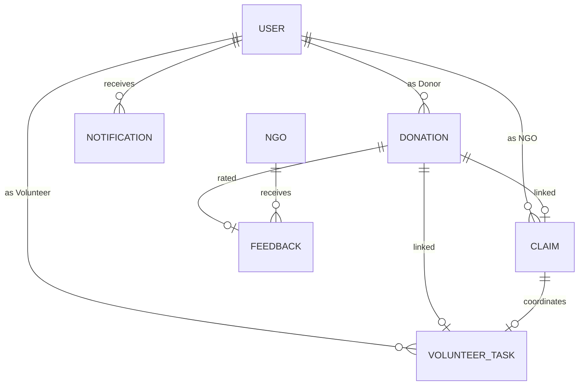

# FINAL YEAR PROJECT DOCUMENTATION: FOOD RESCUE SYSTEM

**Project Title:** Food Rescue - A Platform for Food Waste Mitigation  
**Project Subtitle:** Bridging the Gap Between Surplus Food and Social Impact  

---

## ABSTRACT
The **Food Rescue System** is a comprehensive web-based platform designed to address the critical issue of food waste by connecting surplus food donors with Non-Governmental Organizations (NGOs) and volunteers. In a world where tons of edible food are wasted daily while millions go hungry, this system provides a real-time, transparent, and efficient logistics framework for food redistribution.

Built using the **MERN** stack (MongoDB, Express.js, React, Node.js) with **TypeScript**, the platform features a role-based architecture catering to four distinct user groups: **Donors** (individuals, restaurants, hotels), **NGOs** (social welfare organizations), **Volunteers** (logistics support), and **Admins** (platform oversight). Key features include interactive map integration for location tracking, multiple-image upload for food quality verification, a dynamic "Mission Control" for NGO coordination, and a volunteer broadcasting system for efficient pickup management. The system ensures accountability through "Proof of Distribution" image uploads, a real-time notification system for mission updates, and a feedback mechanism for quality assurance. The live progress tracking timeline and community-driven verification make food rescue a streamlined and impactful process.

---

## TABLE OF CONTENTS
**Title Page** ............................................................................................................................
**Abstract** …………………………………………….………...................…………...…...........i
**List of Tables** ………………………………………..………………......................................ii
**List of Figures** .....………………………………….…….......................………….…….......iii

**Chapter I: Introduction**
1.1 Problem Definition ………………………………..………….............................................1

**Chapter II: System Analysis**
2.1 Existing System …………………..……………….…........….................................3
2.2 Proposed System …………………...………................……..………...…...............3

**Chapter III: Development Environment**
3.1 Hardware Requirements ………………………………….............….......….….......4
3.2 Software Requirements ……………....................…………...….………...…...........4
3.3 Software Description ……………………….…..................….....………....….........5

**Chapter IV: System Design**
4.1 Data Model …………………………………………..............................................12
4.1.1 Entity Relationship Diagram ……….………….......................................13
4.1.2 Data Dictionary …………..............………….….….................................14
4.1.3 Table Relationship ………………....................…….…….......................18
4.2 Process Model ........................................................................................................20
4.2.1 Context Analysis Diagram ………....................………….......................20
4.2.2 Data Flow Diagram …………..................................................................20

**Chapter V: Software Development**
5.1 Modular Description ……………………................................................................25

**Chapter VI: Testing**
6.1 System Testing ……………………….....................................................................30
6.2 Test Data and Output …...……………….................................................................32
6.2.1 Unit Testing ………………………….…......……...................................33
6.2.2 Integration Testing ………..………..........................................................35
6.3 Testing Techniques and Testing Strategies ……………...……..............................37
6.4 Validation Testing ………...………………………................................................38
6.5 User Acceptance Testing .........................................................................................41

**Chapter VII: System Implementation**
7.1 Introduction …………………….............................................................................42
7.2 Implementation ……………………………...........................................................43

**Chapter VIII: Performance and Limitations**
8.1 Merits of the system ………………………………………….................................44
8.2 Limitations of the system ………………………….................................................44
8.3 Future Enhancements ……………………...............................................................44

**Chapter IX: Appendices**
9.1 Sample Screens and Reports …...………………………….....................................45
9.2 User Manual ...........................................................................................................53
9.3 Conclusion ...............................................................................................................58

**Chapter X: References** ..........................................................................................................59

---

### LIST OF TABLES
Table 4.1: User Table Data Dictionary ....................................................................................14
Table 4.2: Donation Table Data Dictionary .............................................................................15
Table 4.3: Claim Table Data Dictionary ..................................................................................16
Table 4.4: VolunteerTask Table Data Dictionary .....................................................................17
Table 4.5: Notification Table Data Dictionary ........................................................................18
Table 4.6: Feedback Table Data Dictionary ............................................................................19

### LIST OF FIGURES
Figure 4.1: Entity Relationship Diagram (ERD) .......................................................................13
Figure 4.2: Context Diagram (Level 0) ....................................................................................20
Figure 4.3: Data Flow Diagram (Level 1) .................................................................................21
Figure 9.1: NGO Dashboard Interface ....................................................................................45
Figure 9.2: Donation Creation Workflow ................................................................................46
Figure 9.3: Volunteer Tracking Timeline .................................................................................47

---

## CHAPTER I: INTRODUCTION

### 1.1 Problem Definition
The global food crisis presents a distressing paradox: while approximately one-third of all food produced globally for human consumption is lost or wasted, one in nine people still goes to bed hungry. In urban environments, large quantities of surplus food are generated daily by restaurants, hotels, and households. However, this food often ends up in landfills due to:
1.  **Lack of Coordination:** Donors have no easy way to find NGOs that need food in real-time.
2.  **Logistical Barriers:** NGOs often lack the manpower or vehicles to collect fresh food immediately before it expires.
3.  **Communication Gap:** There is no centralized platform for volunteers to offer their services for food transportation.
4.  **Accountability:** Donors are often hesitant to donate because they cannot track whether their food actually reached the needy.

The **Food Rescue System** aims to automate this coordination, providing a transparent and efficient logistics pipeline for surplus food.

---

## CHAPTER II: SYSTEM ANALYSIS

### 2.1 Existing System
The "Existing System" refers to the traditional manual methods used for food donation:
- **Phone Calls & SMS:** Donors must manually call local NGOs, which is time-consuming and inefficient.
- **Physical Searching:** NGOs often have to travel blindly to potential donor sites without knowing the quantity or quality of food available.
- **No Real-time Tracking:** There is no system to track the status of a donation from pickup to distribution.
- **Manual Records:** Documentation is mostly paper-based, leading to errors and lack of platform-wide statistics.

### 2.2 Proposed System
The "Proposed System" is a digital ecosystem designed to optimize food rescue operations:
- **Real-time Availability:** Donors can post food items with photos, quantity, and expiration details instantly.
- **Role-Based Workflows:** Distinct interfaces for Donors, NGOs, and Volunteers ensure focused task management.
- **Automated Logistics:** NGOs can broadcast "pickup tasks" to a network of volunteers, solving the last-mile delivery problem.
- **Visual Verification:** Requirement for "Proof of Distribution" photos ensures the food reaches its destination.
- **Interactive Maps:** Integration with OpenStreetMap (via Leaflet) provides exact pickup and drop-off coordination.
- **Feedback Loop:** Post-delivery ratings and comments between Donors and NGOs to ensure system integrity.
- **Real-time Notifications:** Automated alerts for status changes, mission assignments, and verification.

---

## CHAPTER III: DEVELOPMENT ENVIRONMENT

### 3.1 Hardware Requirements
- **Processor:** Intel Core i5 (or equivalent) / Apple M1 or higher.
- **RAM:** 8GB (Minimum), 16GB (Recommended).
- **Storage:** 256GB SSD (Min 10GB free for local development).
- **Network:** Stable internet connection for API services and documentation.

### 3.2 Software Requirements
- **Operating System:** Windows 10/11, macOS, or Linux.
- **Runtime:** Node.js v18.x or higher.
- **Database:** MongoDB Atlas (Cloud) or MongoDB Community Server (Local).
- **Frontend Framework:** React.js v18.0 with Vite (Build tool).
- **Language:** TypeScript 5.0 (Strict Typing).
- **Styling:** Tailwind CSS for responsive UI design.
- **Version Control:** Git & GitHub.

### 3.3 Software Description
- **MongoDB:** A NoSQL database used for storing flexible data structures like donation details and user profiles.
- **Express.js:** A minimal web application framework for Node.js, used to build the RESTful API endpoints.
- **React.js:** Used for building a dynamic, component-based user interface with premium aesthetics.
- **Node.js:** The JavaScript runtime that powers the backend server.
- **TypeScript:** Adds static typing to JavaScript, significantly reducing runtime errors and improving codebase maintainability.
- **Lucide Icons & Tailwind CSS:** Combined to create a premium, glassmorphism-inspired UI with smooth animations.

---

## CHAPTER IV: SYSTEM DESIGN

### 4.1 Data Model
The system uses a document-oriented data model in MongoDB to store entities and their relationships.

#### 4.1.1 Entity Relationship Diagram (ERD)

#### 4.1.2 Data Dictionary

**Table 4.1: User Table (Collection: users)**
| Field | Type | Description |
| :--- | :--- | :--- |
| `_id` | ObjectId | Primary Key |
| `name` | String | Full name / Organization name |
| `email` | String | Unique login email (Indexed) |
| `role` | Enum | DONOR, NGO, VOLUNTEER, ADMIN |
| `phone` | String | Contact number (Verified) |
| `address` | String | Physical location |
| `bio/orgDetails`| String | Descriptive information for public profile |
| `isVerified`| Boolean | Account verification status (Admin controlled) |
| `preferences`| Object | Notification and accessibility settings |

**Table 4.2: Donation Table (Collection: donations)**
| Field | Type | Description |
| :--- | :--- | :--- |
| `_id` | ObjectId | Primary Key |
| `donorId` | ObjectId | Ref to Users (Donor) |
| `foodCategory`| Enum | Veg, Non-Veg |
| `foodType` | String | Name of food item |
| `quantity` | Number | Amount available |
| `status` | Enum | AVAILABLE, CLAIMED_BY_NGO, ASSIGNED, PICKED_UP, DISTRIBUTED |
| `location` | Point | GeoJSON [Longitude, Latitude] |
| `images` | [String] | Array of image URLs |

**Table 4.3: Claim Table (Collection: claims)**
| Field | Type | Description |
| :--- | :--- | :--- |
| `_id` | ObjectId | Primary Key |
| `donationId`| ObjectId | Ref to Donations |
| `ngoId` | ObjectId | Ref to Users (NGO) |
| `pickupMode`| Enum | SELF, VOLUNTEER |
| `status` | Enum | PENDING, IN_PROGRESS, COMPLETED |

**Table 4.5: Notification Table (Collection: notifications)**
| Field | Type | Description |
| :--- | :--- | :--- |
| `_id` | ObjectId | Primary Key |
| `recipient` | ObjectId | Ref to Users |
| `type` | Enum | Status changes, verify, alerts |
| `title/msg` | String | Notification content |
| `read` | Boolean | Read status tracking |

**Table 4.6: Feedback Table (Collection: feedbacks)**
| Field | Type | Description |
| :--- | :--- | :--- |
| `_id` | ObjectId | Primary Key |
| `donationId`| ObjectId | Ref to Donations (Unique) |
| `donorId` | ObjectId | Ref to Users (Donor) |
| `ngoId` | ObjectId | Ref to Users (NGO) |
| `rating` | Number | Integer (1-5) |
| `comment` | String | Qualitative feedback |

#### 4.1.3 Table Relationship
- A **Donation** is created by one **Donor**.
- One **Donation** can be claimed by only one **NGO** (via **Claim**).
- One **NGO** can assign many **VolunteerTasks** (one per donation).
- A **VolunteerTask** can be assigned to one **Volunteer** or broadcasted to many.

### 4.2 Process Model

#### 4.2.1 Context Analysis Diagram
The system sits at the center, interacting with four external entities: Donors (input food data), NGOs (request food), Volunteers (provide delivery services), and Admins (manage platform state).

#### 4.2.2 Data Flow Diagram (Level 1)
1.  **Donation Flow:** Donor → Post Food → Database → NGO View.
2.  **Claim Flow:** NGO → Claim Donation → Update Status → Create Logistics Task.
3.  **Logistics Flow:** Volunteer → Search Tasks → Accept → Pickup → Deliver → Proof Upload.
4.  **Feedback Flow:** Donor → View Completed Donation → Submit Rating/Comment → Profile Stats Update.
5.  **Notification Flow:** Event Trigger (Claim/Deliver) → Generate Notification → Recipient Alert.

---

## CHAPTER V: SOFTWARE DEVELOPMENT

### 5.1 Modular Description
1.  **Authentication Module:** Handles secure JWT-based login, role-based registration, and protected routing.
2.  **Donor Module:** Features a "Post Surplus" form with map-pin GPS coordinates and multi-image upload. Provides a history of donations and their live status.
3.  **NGO Mission Control:** A real-time dashboard where NGOs browse available food, claim items, and manage logistics (assigning volunteers or self-pickup).
4.  **Volunteer Logistics Module:** Allows volunteers to find available tasks nearby, accept deliveries, and update the physical status of the food.
5.  **Admin Oversight:** A global dashboard for user management (blocking/verifying), platform statistics, and manual mission overrides.
6.  **Notification System:** A real-time engine that triggers alerts for pickup requests, delivery confirmations, and verification status.
7.  **Feedback & Profile Module:** Handles the collection of post-mission reviews and manages persistent public profiles for all stakeholders.

---

## CHAPTER VI: TESTING

### 6.1 System Testing
System testing was performed to verify that the integrated software meets the specified requirements. This included testing the end-to-end flow from donation creation to distribution.

### 6.2 Test Data and Output
#### 6.2.1 Unit Testing
- **User Service:** Verified password hashing and JWT token generation.
- **Validation:** Tested that a donation cannot be posted without valid GPS coordinates.

#### 6.2.2 Integration Testing
- **Claim-Task Sync:** Verified that when an NGO claims a donation, a `VolunteerTask` is automatically created if the mode is set to 'VOLUNTEER'.
- **Notification Triggering:** Verified that performing actions (Claiming, Assigning, Distributing) sends real-time alerts to the relevant stakeholders.
- **Feedback Integrity:** Verified that feedback can only be submitted once per donation and only after the status is set to 'DISTRIBUTED'.

### 6.4 Validation Testing
- **Role Guards:** Verified that a Volunteer cannot access the Admin dashboard.
- **Image Upload:** Verified that only valid image formats are accepted for distribution proof.
- **Notification Read Status:** Verified that clicking a notification marks it as 'Read' and redirects to the correct resource.
- **Feedback Rating Range:** Verified that the system rejects ratings outside the 1-5 range at both the API and Schema levels.

---

## CHAPTER VII: SYSTEM IMPLEMENTATION

### 7.2 Implementation
The project follows a modular deployment strategy:
- **Backend:** Deployed using Node.js with environment variables for MongoDB connection strings and JWT secrets.
- **Frontend:** Built using Vite, producing a high-performance static asset bundle.
- **Database:** Hosted on MongoDB Atlas for global availability and automated scaling.

---

## CHAPTER VIII: PERFORMANCE AND LIMITATIONS

### 8.1 Merits of the system
- **High Transparency:** Both donors and NGOs can track the food in real-time.
- **Scalability:** The MERN architecture allows for easy addition of new roles or regions.
- **Responsive UI:** Works seamlessly on mobile devices for volunteers on the go.

### 8.2 Limitations
- **Internet Dependency:** Requires an active internet connection to update statuses.
- **Physical Verification:** While photos help, the system cannot physically taste the food to ensure it's not spoiled.

### 8.3 Future Enhancements
- **AI Expiration Prediction:** Using machine learning to estimate food shelf-life based on photos.
- **In-app Chat:** Real-time messaging between NGOs and Volunteers.

---

## CHAPTER IX: APPENDICES

### 9.1 Sample Screens
- **Landing Page:** Features a premium hero section with "Rescuing Food, Saving Lives" CTA.
- **Donor Dashboard:** Shows a 3-step timeline (Posted → Claimed → Distributed) and incoming feedback.
- **NGO Mission Details:** Displays donor's contact card, pickup map, and distribution proof upload area.
- **Public Profiles:** Showcases impact metrics, verification status, and past reviews for NGOs and Donors.
- **Notification Center:** A toggleable panel showing all recent mission alerts and system messages.

### 9.2 User Manual
1.  **For Donors:** Sign up → "Post Food" → Enter details & upload photos → Wait for claim → Once distributed, "Leave Feedback" for the NGO.
2.  **For NGOs:** Sign up → "Browse Food" → "Claim" → Choose Pickup Mode → Assign Volunteer.
3.  **For Volunteers:** Sign up → "Find Deliveries" → "Accept" → Drive to site → "Mark Picked Up" → "Mark Delivered" + Photo.

### 9.3 Conclusion
The Food Rescue System successfully demonstrates how technology can be used to solve real-world logistical challenges in the fight against hunger. By providing a centralized, transparent platform, it empowers communities to reduce waste and maximize social impact.

---

## CHAPTER X: REFERENCES
1.  MERN Stack Development with TypeScript, Official Documentation.
2.  OpenStreetMap API and Leaflet Integration Guides.
3.  United Nations Sustainable Development Goals (SDG 2: Zero Hunger).
